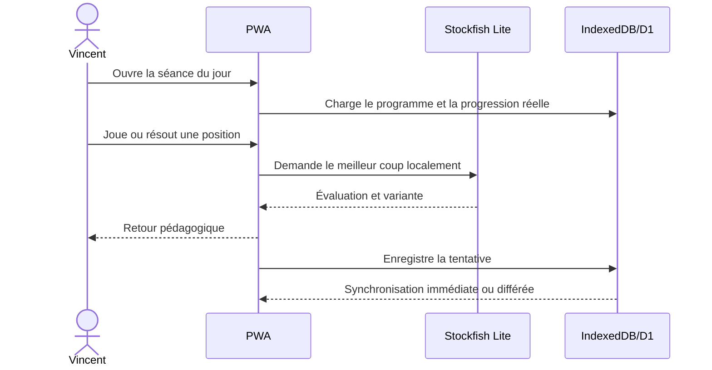
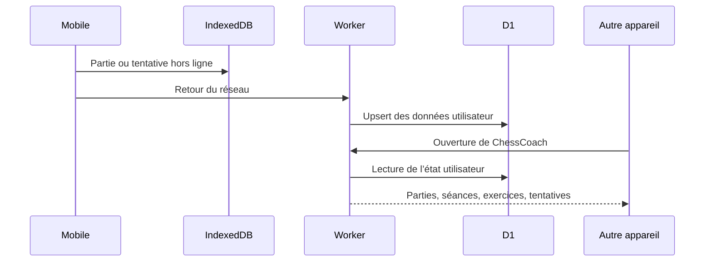
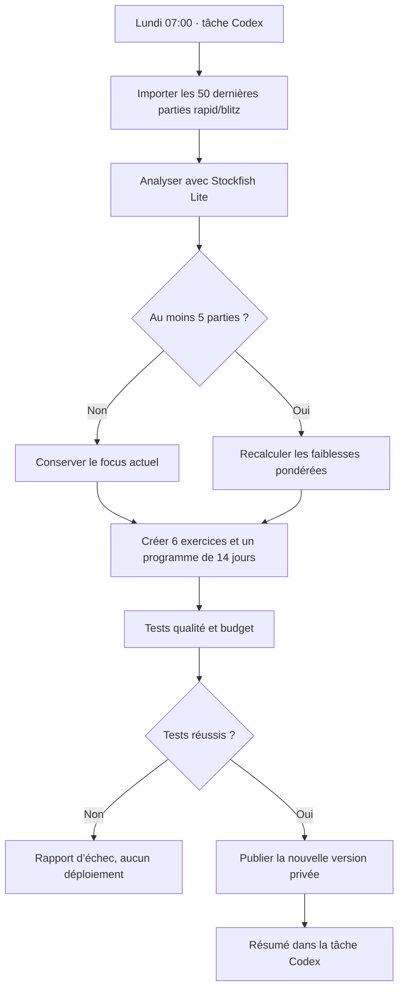

# Architecture ChessCoach

## Vue d’ensemble

```mermaid
flowchart LR
    U["Vincent · mobile ou Windows"] --> PWA["PWA ChessCoach"]
    PWA --> SW["Service worker · cache hors ligne"]
    PWA --> IDB["IndexedDB · cache hors ligne"]
    PWA --> SF["Stockfish 18 Lite/WASM · appareil"]
    PWA --> API["API Cloudflare Worker"]
    API --> D1["D1 · parties, séances, exercices et tentatives"]
    API --> CC["API publique Chess.com"]

    CODEX["Tâche Codex hebdomadaire"] --> JOB["coach:refresh"]
    JOB --> CC
    JOB --> SFCLI["Stockfish Lite/WASM · exécution locale"]
    SFCLI --> SNAP["Snapshot agrégé · programme 14 jours et exercices"]
    SNAP --> TEST["Tests"]
    TEST --> DEPLOY["Déploiement privé Sites/Cloudflare"]
    DEPLOY --> PWA
```

## Responsabilités

| Composant | Rôle | Impact |
|---|---|---|
| PWA | Échiquier, séance, installation | Expérience tactile et rapide |
| Stockfish Lite | Bot et analyse personnelle | Aucun coût de serveur d’échecs |
| IndexedDB | Cache local des données D1 | Utilisable sans réseau |
| Worker + D1 | Source durable des parties, séances, exercices et tentatives | Continuité entre appareils |
| Codex planifié | Revue hebdomadaire des parties | Programme qui évolue sans sur-réagir |
| IA narrative | Explications du coach, plus tard | Budget indépendant et plafonnable |

## Flux d’entraînement

Une partie contre Stockfish terminée au mat, au temps ou par abandon est enregistrée avec son PGN, son résultat et sa cadence. Stockfish Lite analyse les coups du joueur sur l’appareil, conserve jusqu’à trois positions critiques et crée l’exercice prioritaire de la prochaine séance. IndexedDB reçoit immédiatement les données, puis D1 devient la source durable au retour du réseau.

Un exercice erroné reste verrouillé jusqu’au réessai. Le premier échec affiche le coup joué, le deuxième donne un principe, et le troisième révèle une comparaison avec une flèche vers le meilleur coup.

## Synchronisation multiappareil

## Flux de maintenance

## Évolutivité

`EngineAdapter` isole le moteur. Stockfish complet ou Maia pourront être ajoutés plus tard sans modifier le calcul de priorité, les exercices ni l’interface.
