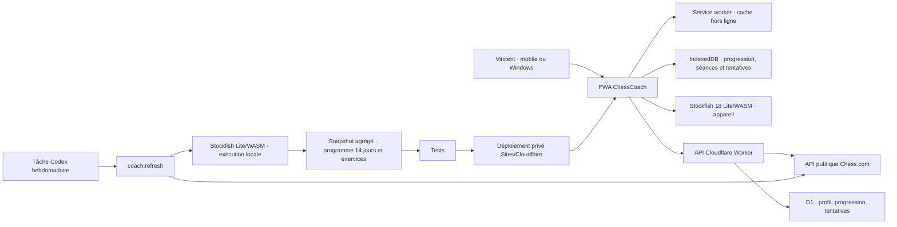
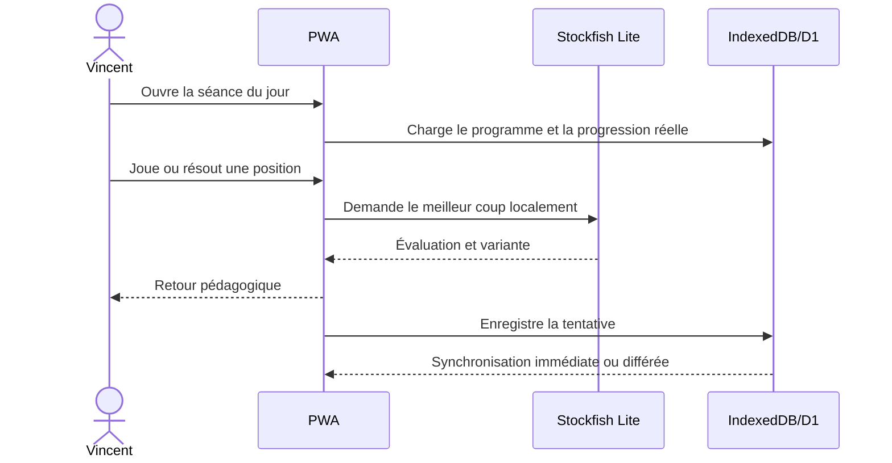
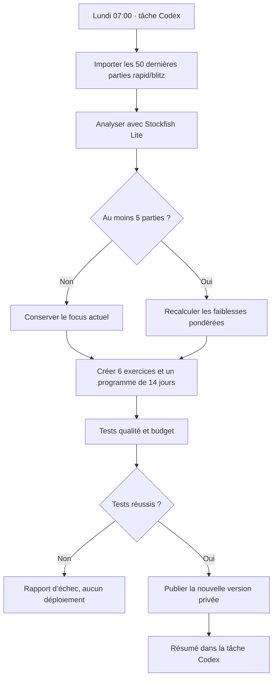

# Architecture ChessCoach

## Vue d’ensemble

## Responsabilités

| Composant | Rôle | Impact |
|---|---|---|
| PWA | Échiquier, séance, installation | Expérience tactile et rapide |
| Stockfish Lite | Bot et analyse personnelle | Aucun coût de serveur d’échecs |
| IndexedDB | Cache local, progression et historique de séances | Utilisable sans réseau, sans fausse progression |
| Worker + D1 | Synchronisation et données durables | Continuité entre appareils |
| Codex planifié | Revue hebdomadaire des parties | Programme qui évolue sans sur-réagir |
| IA narrative | Explications du coach, plus tard | Budget indépendant et plafonnable |

## Flux d’entraînement

## Flux de maintenance

## Évolutivité

`EngineAdapter` isole le moteur. Stockfish complet ou Maia pourront être ajoutés plus tard sans modifier le calcul de priorité, les exercices ni l’interface.
